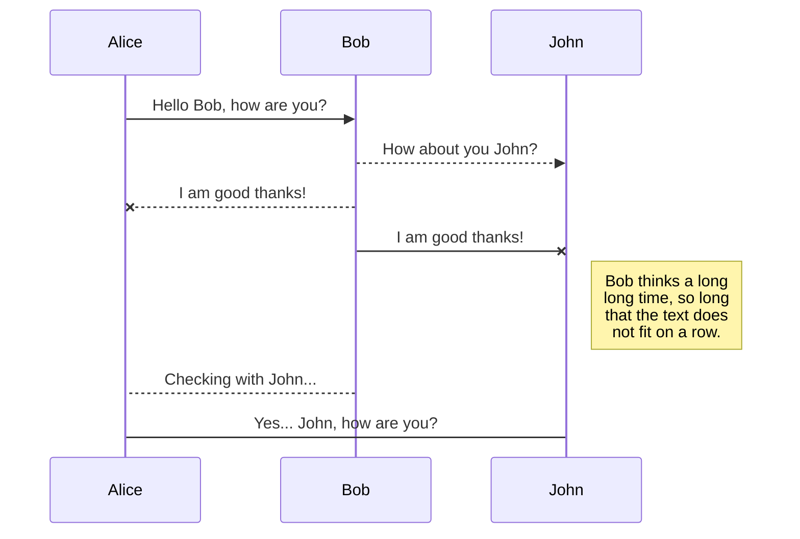
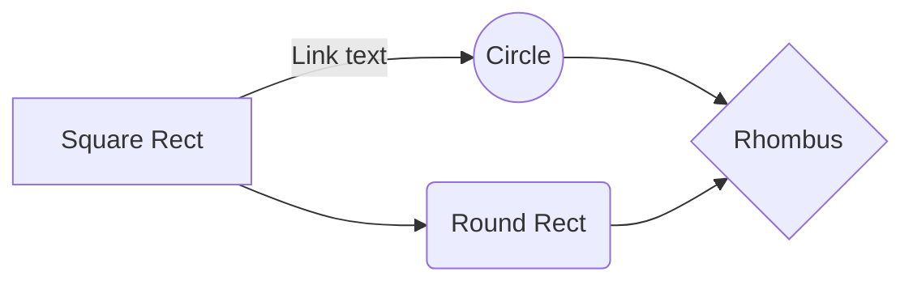

# Configuração automatizada de sistema!

Os scripts acima servem para automatizar parte da configuração do ambiente de desenvolvimento baseado em node.js, react js e react native. Eles também instalam alguns programas de uso comum.  Eles foram criados por mim para uso pessoal, mas estou compartilhando, caso alguém tenha a mesma necessidade minha, ou mesmo, queira aperfeiçoá-los (não sou especialista em shell script, mas estou ciente que muita coisa pode ser melhorada)...

> **Observação:** Os testes foram efetuados no Ubuntu Desktop 18.04 LTS e 20.04 LTS. Em ambos os casos não ocorreu nenhum tipo de problema.

## Requisitos

 - Ubuntu Desktop 18.04 LTS ou 20.04 LTS (Até agora os testes utilizando os scripts foram feitos somente nestas versões), mas é possível que funcionem em outras versões a partir do 18.04 LTS;
 - Os Scripts foram testados em um sistema limpo, recém instalado (instalação completa com todas as aplicações e pacotes nativos em vez da instalação mínima). Os impactos em sistemas já configurados ainda não foram mensurados. Utilize com cuidado.
 - Você ****DEVE ALTERAR** a linha 53** do script1 inserindo o seu nome e o seu email, pois esta linha configura os seus dados do GitHub para que você possa utilizar o Git.
## O que os scripts fazem?
**Script1:** 
**Instala:** 
 - cURL (apt);
 - VS Code (snap);
 - Insomnia (snap);
 - DBeaver (snap);
 - Discord (snap);
 - Spotify (snap);
 - Gimp (snap);
 - Google Chrome (.deb);
 - DevDocs (.deb);
 - Steam (.deb - por que não? rsrs);
 - Deepin Screenshot (apt);
 - Peek (apt);
 - Wine (apt);
 - Git (apt);
 - Zsh (apt).

**Configura:**

 - Após instalar o git, o configura com o seu nome de usuário e email;
 - Configura o VS Code com configurações padrão, mas se você já possuir um arquivo
   de configuração do VS Code ele não será alterado;
 - Configura o Zsh como terminal padrão para o seu usuário;
 - Gera um arquivo leia-ME.txt na pasta Downloads com instruções das configurações que ainda restam fazer (extensões a serem instaladas no VS Code);
 - Reinicia a máquina (para garantir que a configuração do Zsh tenha efeito).

**Script2:**

Instala o Oh My Zsh.

**Script3:**

 - Instala o tema Dŕacula para o terminal;
 - Instala a fonte Firacode;
 - Instala e configura o tema SpaceShip para o Zsh;
 - Instala Plugins básicos para o Zsh.

**Script4:**

Instala Plugins adicionais para o Zsh.

**Script5:**

 - Instala o Node (versão estável);
 - Instala o NVM;
 - Instala o Yarn;
 - Instala CLI do React APP;
 - Instala o Docker (configura para inicializar automaticamente);
 - Instala JDK 8 no diretório padrão;
 - Instala as Libs gráficas para o Android Studio;
 - Configura as variáveis de ambiente utilizadas pelo Android Studio no terminal;
 - Baixa e extrai o Android Studio na pasta padrão ~/;
 - Configura variável de ambiente do Android Studio no terminal (o comando studio.sh já estará disponível na próxima vez que o terminal for aberto);
 - Exclui a pasta ~/Downloads/Programas (Esta pasta é criada pelos cripts de maneira temporária para armazenar os programas .db e o arquivo de instalação do Android Studio);
 - Por fim, mostra as instruções a respeito das configurações manuais que ainda faltam.

**Script6 (Opcional)**

A execução deste script é opcional. Sua função é instalar o recurso KVM para ajudar na emulação de disposivos android configurados no Android Studio. Este script só deve ser executado se for informado durante a configuração manual do Android Studio que o seu computador é compatível.

## Sequência de utilização
Nos testes, os scripts foram executados de acordo com a sequência abaixo:
**script1, script2, script3,, script4, script5, script6.** 
>É Importante que após a execução de cada script o terminal seja fechado para que ocorra a atualização de algumas configurações, como por exemplo, variáveis de ambiente:

## UML diagrams

You can render UML diagrams using [Mermaid](https://mermaidjs.github.io/). For example, this will produce a sequence diagram:

And this will produce a flow chart:

